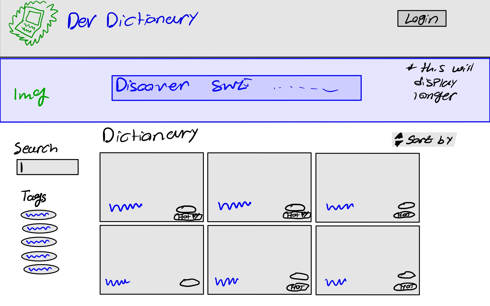

# Project 3: Design Journey

**For each milestone, complete only the sections that are labeled with that milestone.** Refine all sections before the final submission.

You are graded on your design process. If you later need to update your plan, **do not delete the original plan, rather leave it in place and append your new plan _below_ the original.** Then explain why you are changing your plan. Any time you update your plan, you're documenting your design process!

**Replace ALL _TODOs_ with your work.** (There should be no TODOs in the final submission.)

Be clear and concise in your writing. Bullets points are encouraged.

**Everything, including images, must be visible in _Markdown: Open Preview_.** If it's not visible in the Markdown preview, then we can't grade it. We also can't give you partial credit either. **Please make sure your design journey should is easy to read for the grader;** in Markdown preview the question _and_ answer should have a blank line between them.


## Design Plan (Milestone 1)

**Make the case for your decisions using concepts from class, as well as other design principles, theories, examples, and cases from outside of class (includes the design prerequisite for this course).**

You can use bullet points and lists, or full paragraphs, or a combo, whichever is appropriate. The writing should be solid draft quality.


### Catalog (Milestone 1)
> What will your catalog website be about? (1 sentence)

Interactive dictionary for various Technologies in Software Development


### _Consumer_ Audience (Milestone 1)
> Briefly explain your site's _consumer_ audience. Your audience should be specific, but not arbitrarily specific. (1 sentence)
> Justify why this audience is a **cohesive** group. (1-2 sentences)

Beginner and prospective software engineers who wish to clarify concepts and further their learning about software development technologies

This is a cohesive audience for a few reasons. One being that this audience is not too specific, it may include students, self-learning programmers, and junior/beginner programmers in industry. This audience is also not too broad because it is specific to a certain field of study and a certain occupation. This audience is cohesive because despite all these individuals potentially coming from various backgrounds, they all share the common goal of further expanding their software engineering knowledge and understanding confusing software engineering jargon.


### _Consumer_ Audience Goals (Milestone 1)
> Document your _consumer_ audience's goals for using this catalog website.
> List each goal below. There is no specific number of goals required for this, but you need enough to do the job (Hint: It's more than 1. But probably not more than 3.)
> **Hint:** Users will be able to view all entries in the catalog and insert new entries into the catalog. The audience's goals should probably relate to these activities.

Goal 1: Clarify confusing terms/jargon to better engage in software engineering discussions

- **Design Ideas and Choices** _How will you meet those goals in your design?_
  - A user oriented toward this goal would prefer a quick experience where he queries quickly and is shown a term where he finds a quick blurb or explanation of an technology just so he can be acquainted with it (not exactly learn it). As such, I will implement a search across the media catalog, include sorting and tags. In the details pages, I will also include a quick blurb/summary and a quick coding example of what the technology is and how it's used

- **Rationale & Additional Notes** _Justify your decisions; additional notes._
  - Since the user wishes for a fast experience, querying will allow him to reach exactly what he is looking for. In case, the name isn't recalled, the user can also sort and filter between items to find it. When the user accesses the details page of an item, they will be met with a quick definition/summary and example so that they are familiarized and can discuss the technology broadly

Goal 2: Explore various areas of software development and learn something new

- **Design Ideas and Choices** _How will you meet those goals in your design?_
  - I will meet this goal by creating tags of various semi-broad fields and categories in software development. These tags will be assigned to various pieces of media and can be filtered accordingly. I will also include in depth description about what the technology is on the details page, showcase coding examples, a sample coding question and answer or use cases and also link to further resources/the technology itself

- **Rationale & Additional Notes** _Justify your decisions; additional notes._
  - The creation of such tags will allow users to see various fields and decide which ones they want to focus on and explore. Now, the site is more personalized to what they want and the goal can be easily acheived. Since they wish to learn something new, the in-depth description will allow them to better understand, an example will help them visualize how to use a certain technology, and the question will help solidify their understanding. The link to further resources also helps if they wish to pursue further.

Goal 3: To stay-up-to-date and familiar with latest software development trends

- **Design Ideas and Choices** _How will you meet those goals in your design?_
  - To meet this goal, I will simply include a marker that describes a "hot" or "trending" technology. When clicked into, the user can see a quick definition, quick example, in-depth information, in-depth example, a question-answer and a link to a further resources. We would also include a "review" of the technology which will be sourced by industry individuals.
- **Rationale & Additional Notes** _Justify your decisions; additional notes._
  - The "hot" or "trending" technology marker will allow users to see a collection of these trending technologies. They can then view information on the technology and familiarize themselves with it as much as they desire. The review helps them understand members of the industry feel about this technology in terms of it's relevance


### _Consumer_ Audience Device (Milestone 1)
> How will your _consumer_ audience access this website? From a narrow (phone) or wide (laptop) device?
> Justify your decision. (1 sentence)

Laptop

The audience goals are to clarify and understand confusing terms, explore various fields of software engineering and learn something, and see hot technologies. In all, they wish to learn something new and though quickly, they want to sit down and really view it. The laptop is the best option for this because users may wish to spend some time to digest the material since software engineering technology can get quite complex. They also may wish to actually access the technology online while reading about it and most of these technologies require a laptop.

### _Consumer_ Persona (Milestone 1)
> Use the goals you identified above to develop a persona of your site's _consumer_ audience.
> Your persona must have a name and a face. The face can be a photo of a face or a drawing, etc.


**Name:**

Reginald

- A computer science senior who is attempting to head into the software engineering industry

**Factors that Influence Behavior:**

- Reginald has basic, typical college computer science curriculum programming knowledge (is relatively new to industry required skills and knowledge)
- Reginald is interviewing repeatedly (wants to ensure that he knows exactly what his interviewer is talking about when new skills are brought up)
- Reginald is facing insecurity and imposter syndrome (due to being accustomed to college classes and coding assignments and not really having learned industry techniques and technologies)
- Reginald is still in school (time constraints when learning, has to prioritize schoolwork and graduating)

**Goals:**

- Reginald wants to familiarize himself with various software engineering and hot industry technologies
- He wants to further explore various fields of software engineering and really dedicate himself to a single field after graduation
- Reginald wants to feel confident in discussions and better understand and communicate well with other software engineers, clients, and supervisors

**Obstacles:**

- Limited time available to learn due to school schedule
- Feeling intimidated and overwhelmed by the vast amount of information and technologies on the internet
- Only learned strong foundations of computer science in college (data structures, theory, algorithms, etc) but not necessarily how to apply it and use technologies in industry

**Desires:**

- Wants to feel competent and confident in his software engineering abilities and discussions
- Wants to easily understand technical jargon with straightforward simple minimal descriptions without being overloaded with information
- Be ready to adapt to industry trends and fit in when transitioning to industry standards and practicing


### _Administrator_ Audience (Milestone 1)
> Briefly explain your site's _administrator_ audience. Your audience should be specific, but not arbitrarily specific. (1 sentence)
> Justify why this audience is a **cohesive** group. (1-2 sentences)

An experienced, professional computer scientist or software developer

This is a cohesive audience because it is not overly specific nor broad. It is describing, in moderate specificity, of individuals who are considered computer scientists or software developers who have considerable experience. This is not overly specific as it may include computer science professors, teachers, principal software engineers, and maybe PHD computer science candidates and researchers.


### _Administrator_ Audience Goals (Milestone 1)
> Document your _administrator_ audience's goals for using this catalog website.
> List each goal below. There is no specific number of goals required for this, but you need enough to do the job (Hint: It's more than 1. But probably not more than 3.)
> **Hint:** Users will be able to view all entries in the catalog and insert new entries into the catalog. The audience's goals should probably relate to these activities.

Goal 1: Help provide quality content and resources to prospective junior developers and prospective students

(The user will wish to provide information to individuals who may be candidates for a junior developer role or a student looking to learn)

- **Design Ideas and Choices**
- To allow for this, I plan to create a quick response form that allows the users to upload a media item and catalog and also update other catalogs. I will make this form include a quick definition, quick example, in-depth info and in-depth coding example and associated tags of a media piece.
- **Rationale & Additional Notes** _Justify your decisions; additional notes._
  - This allows for the user to pursue their goal of providing content and resources. Through a form, they'll be able to create a new media item or edit a previous one if it has faulty information. When complete, it'll be a polished media item describing a technology that they can showcase to prospective consumers.

Goal 2: Provide opinions on various software development technologies and comment on if they think it is hot or not

- **Design Ideas and Choices** _How will you meet those goals in your design?_
  - I will allow the user to write a review of a media item they're creating as well as write a review of other media items and also vote whether it is hot or not.
- **Rationale & Additional Notes** _Justify your decisions; additional notes._
  - Allowing them to review technologies and also voting whether they're hot or not will allow them to share their opinions on specific technologies. After they share this, technologies they voted on may have a HOT marker or may have it removed and the average review may change.

**NOTE:** The HOT marker marks a technology as HOT

### _Administrator_ Persona (Milestone 1)
> Use the goals you identified above to develop a persona of your site's _administrator_ audience.
> Your persona must have a name and a face. The face can be a photo of a face or a drawing, etc.


**Name:**
Thomas

A senior software engineer with 15 years of experience

**Factors that Influence Behavior:**

- Thomas has a busy work schedule (does not have luxury to spend considerable time outside of work)
- Thomas is passionate about software engineering
- Thomas needs help in his developer team
- Thomas has a critical boss who is strict on deadlines and wants to understand the industry popularity of the technology he uses.
- Had multiple jobs in various fields of software engineering

**Goals:**

- Help onboard potential software engineers by providing high quality content and resources to junior developers and prospective students
- Share opinions on what technologies work best practically and are best for industry practices

**Obstacles:**

- Finding the time to create and curate content for the media catalog.
- Staying up to date with latest trends and technology without falling into confirmation bias

**Desires:**

- To make a positive impact on the software development community
- Help junior developers and prospective students learn and grow
- Help others understand what is "hot" and trending in industy and also what is important and useful to developers

### Catalog Data (Milestone 1)
> Using your personas, identify the data you need to include in the catalog for your site's audiences.
> Justify why this data aligns with your persona's goals. (1 sentence)

Reginald will need the following

- Technology name
- Technology Image
- Technology Definition
- Technology example
- Technology Description
- Technology code
- Technology resources
- Technology reviews
- Technology tags

Thomas will need the following

- Technology name
- Technology Image
- Technology Definition
- Technology example
- Technology Description
- Technology code
- Technology resources
- Technology reviews
- Technology tags
- Technology mean_review
- Technology hot_or_not

This data aids the goals of both personas. For Reginald, seeing all this information allows him to be familiarized with software engineering technologies and will allow him to be confident in his discussions/communications. Moreover, the tags will allow him to see what is hot or not and further diversify himself among various fields. For Thomas, it allows him to provide information to help provide content and potential onboard young software engineers. Moreover, the mean_review will be showcased and will allow him to give his opinion on various technologies and vote whether they're hot or not


### Site Design (Milestone 1)
> Design your catalog website to address the goals of your personas.
> Sketch your site's design:
>
> - These are **design** sketches, not _planning_ sketches.
> - Use text in the sketches to help us understand your design.
> - Where the content of the text is unimportant, you may use squiggly lines for text.
> - **Do not label HTML elements or annotate CSS classes.** This is not a planning sketch.
>
> Provide a brief explanation _underneath_ each sketch. (1 sentence)
> **Refer to your persona by name in each explanation.**



The sketch above employs a thumbnail grid catalog page. Items of the media catalog are ordered as grid/tiled enteries and it allows the user to see mutliple views simultaneously and have space to internalize each item. The sort is included on the top right, the filters and search are on the left. The image/media largely dominates the users view. As Reginald views this, he will be more drawn to the images and will be able to query his values accordingly. This layout primes him to really explore various types of technologies and allows him to really diverisfy himself with what technologies belong in which tags/fields.


The sketch above describes a list of tagged items to represent media items in the catalog page. The items are stacked vertically and can be clicked into. This allows the user to see multiple items in more so a list format. The image/media is showcased but is not as dominant as the above sketch. The filters, search, and sort are where they were described in sketch 1. As reginald views this, he will be able to find and search for the items he'd like faster. If he is exploring, he will be able to see various technology faster. Overall, Reginald will be able to do what he likes faster with this design


This sketch showcases a details page where the title is on the top and information is stacked sequentially below it. As Reginald views this, he will view the image then view the "quick ____" information first. The tags are below the image as secondary content because the Reginald already viewed these pieces of content. We also include the reviews here since it is more so a visual in Reginalds eyes as opposed to actual text content.


In this sketch, the quick ____ information is below the visuals. This is because Reginalds eyes will be drawn to the visual first and as a result, he will see the quick information first. As he goes, Reginald will see more detailed items and be able to digest the content as he so pleases.

I plan to use sketch 1 of the catalog page and sketch 1 of the details page
### Catalog Design Patterns (Milestone 1)
> Explain how you used design patterns in your site's design. (1-2 sentences)

In the sketches, I employed a left alignment for nearly all items, besides certain headings and images. The media catalog itself employes either a panel, tiled grid line or a vertical, stacked tagged list. I chose the panel tiled grid lines as my sites primary design. In this design, and as we can see, this item also has left aligned filters and searches and a commonly viewed sort button on the top right. We also have image indicators of sort and it will allow the user to sort accordingly.


## Implementation Plan (Milestone 1, Milestone 2, Milestone 3, Final Submission)

### Database Schema (Milestone 1)
> Plan the structure of your database. You may use words or a picture.
> A bulleted list is probably the simplest way to do this.
> Make sure you include constraints for each field.

Table: techs

- id: INT {U, AI, NN, PK},
- name: INT {U, NN}
- media: --------- ?
- definition: TEXT {U, NN}
- example: TEXT {}
- description: TEXT {U, NN}
- resource_id INT {U, NN FK -> resources.id}
- review_id INT {U, NN FK -> reviews.id}

Table: resources

- id: INT {U, AI, NN, PK}
- name: TEXT {NN}
- subject: TEXT {NN}
- url: TEXT {NN}

Table: reviews

- id: INT {U, AI, NN, PK}
- rating_mean: REAL {NN}
- rating_count: INT {NN}
- hot_yes_count: INT {NN}
- hot_count: INT {NN}

Table: tags

- id: INT {U, AI, NN, PK}
- name: TEXT {U, NN}

Table: tech_tags

- id: INT {U, AI, NN, PK}
- tech_id INT {NN, FK -> tech.id}
- tag_id INT {NN, FK -> tags.id}

(if hot_count/vote_count > .8, it's hot)

**revisions**
I revised the database to make fit the project requirements and enable proper joining. I also made the tag name text rather then int as previously planned and also made the rating_mean to be a REAL type to support decimals

### Database Query Plan (Milestone 1, Milestone 2, Milestone 3, Final Submission)
> Plan _all_ of your database queries.
> You may use natural language, pseudocode, or SQL.

```
INSERT * FROM technologies;
```

```
SELECT technologies.name, technologies.media, technologies.definition, technologies.example, technologies.description, reviews.mean_rating, resources.url, reviews.hot_count, reviews.vote_count, tags.name
FROM technologies
INNER JOIN resources ON technologies.resource_id = resources.id
INNER JOIN reviews ON technologies.review_id = reviews.id
INNER JOIN tags ON technologies.tag_id = tags.id;
```

```
SELECT techs.name AS 'tech.name',
    techs.definition AS 'tech.definition',
    techs.example AS 'tech.example',
    techs.description AS 'tech.description',
    resources.name AS 'resource.name',
    resources.url AS 'resource.url',
    reviews.rating_mean AS 'review.rating_mean',
    reviews.rating_count AS 'review.rating_count',
    reviews.hot_yes_count AS 'review.hot_yes_count',
    reviews.hot_count AS 'review.hot_count',
    tags.name AS 'tag.name'
    FROM techs
    INNER JOIN resources ON techs.resource_id = resources.id
    INNER JOIN reviews ON techs.review_id = reviews.id
    INNER JOIN tech_tags ON techs.id = tech_tags.tech_id
    INNER JOIN tags ON tech_tags.tag_id = tags.id
    WHERE techs.id = :techsId;
```


## Complete & Polished Website (Final Submission)

### Accessibility Audit (Final Submission)
> Tell us what issues you discovered during your accessibility audit.
> What do you do to improve the accessibility of your site?

I had a great deal of contrast errors, particularly due to my choice of tag colors and links. I handled these accordingly by making background darker of white text and vice versa so that my website is more accessible


### Self-Reflection (Final Submission)
> Reflect on what you learned during this assignment. How have you improved from Projects 1 and 2?

This was a hard yet fruitful assignment. I feel that I learned alot and I also really enjoyed the process. It felt very new and I am glad that I had the experience. I feel that I am more aware as a web developer as I was in project 1 and 2. I felt that solutions came more naturally and I was able to think about what I wanted to implement in a more structured manner


> Take some time here to reflect on how much you've learned since you started this class. It's often easy to ignore our own progress. Take a moment and think about your accomplishments in this class. Hopefully you'll recognize that you've accomplished a lot and that you should be very proud of those accomplishments! (1-3 sentences)

I am glad I took this course. I feel I learned alot of valuable tools and definitely gained immense experience. I am proud of the projects I have created.


### Collaborators (Final Submission)
> List any persons you collaborated with on this project.

No One


### Reference Resources (Final Submission)
> Please cite any external resources you referenced in the creation of your project.
> (i.e. W3Schools, StackOverflow, Mozilla, etc.)

W3Schools, Mozilla Reference Document, Font Awesome reference document, bootstrap reference document


### Grading: User Accounts (Final Submission)
> The graders will need to log in to your website.
> Please provide the usernames and passwords.

**Administrator User:**

- Username: asad
- Password: monkey

**Consumer User:**

- This website does not support consumer log in

**Note:** Not all websites will support consumer log in. If your website doesn't, say so.


### Grading: Step-by-Step Instructions (Final Submission)
> Write step-by-step instructions for the graders.
> The project if very hard to grade if we don't understand how your site works.
> For example, you must log in before you can delete.
> For each set of instructions, assume the grader is starting from /

_View all entries:_

1. Go to the home page ('/') and scroll down slightly

_View all entries for a tag:_

1. Go to the home page ('/') and scroll down slightly
2. On the left hand side, it will say "Filter by: " and a tag can be selected via the dropdown (only one tag can be selected at a time)
3. To clear a tag, click the red X (❌) next to the tag (it will return to the unfiltered version)

_View a single entry's details:_

1. Click on the image of any entry, it will take you to the respective 'details' page

_How to insert and upload a new entry:_

1. Login with the credentials (username: asad, password: monkey), ensure you remain logged in
2. Scroll to the bottom of the home page ('/') where the image entries end
3. There will be a dashed border with a "add entry" caption and image
4. Click this, it will transport you to a entry-insert page
5. A form will appear and if you fill it out, it will add a page.
   - the technology name, technology definition, technology description should be UNIQUE
   - Fields are assumed to be filled out in it's entirety unless specified optional
   - Images with large sizes may take time

_How to delete an entry:_

1. Login with the credentials (username: asad, password: monkey), ensure you remain logged in
2. To delete a specific entry, access that entries detail page
3. On the details page, click the "Edit Mode" button on the top right
4. Links/buttons will appear next to each item where they can be edited and updated
5. On the bottom, there is a button of a white background and red text that says 'Delete Technology'
6. Click this button, and the technology will be deleted and you will be sent back to the home page
   - All occurrences of the entry will be deleted (techs, tech_tag, reviews) and the file upload will be deleted
